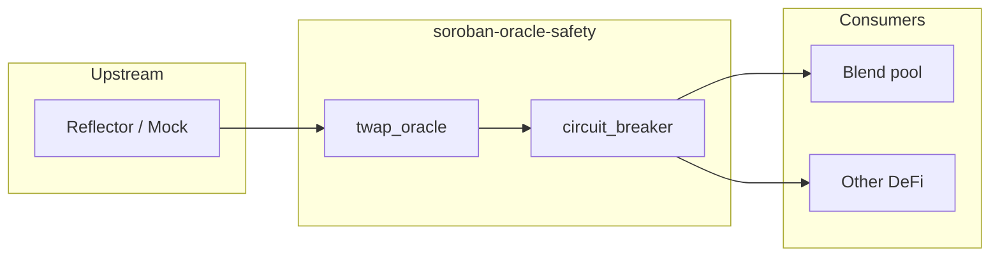

# Architecture

## Components

| Component | Path | Role |
|-----------|------|------|
| `mock_feed` | `contracts/mock_feed` | SEP-40 test oracle (admin-set prices) |
| `circuit_breaker` | `contracts/circuit_breaker` | SEP-40 wrapper: staleness + deviation |
| `twap_oracle` | `contracts/twap_oracle` | SEP-40 adapter: AM-TWAP over source `prices()` |
| `oracle-safety` | `crates/oracle-safety` | Off-chain JSON config types |
| `oracle-safety-ts` | `packages/oracle-safety-ts` | Blend `PoolOracle` validation (pnpm) |

## Data flow

v0 may deploy **twap_oracle** alone or **circuit_breaker(twap(source))** depending on integration test.

## Storage (circuit_breaker)

| Key | Type | Purpose |
|-----|------|---------|
| `Source` | `Address` | Inner SEP-40 oracle |
| `Config` | `CircuitBreakerConfig` | staleness + bps |
| `LastPrice` | `Map<Asset, PriceData>` | deviation check |
| `Admin` | `Address` | config updates |

## Storage (twap_oracle)

| Key | Type | Purpose |
|-----|------|---------|
| `Source` | `Address` | Inner SEP-40 oracle |
| `Periods` | `u32` | TWAP window count |
| `Admin` | `Address` | set_periods |

## Out of scope v0

- Dashboards, indexers, explorers, TVL monitors
- GM-TWAP, multi-source aggregation (v1)
- Mainnet production deployment (testnet only in Phase 6)
- Drips GitHub issues (until repo accepted)
